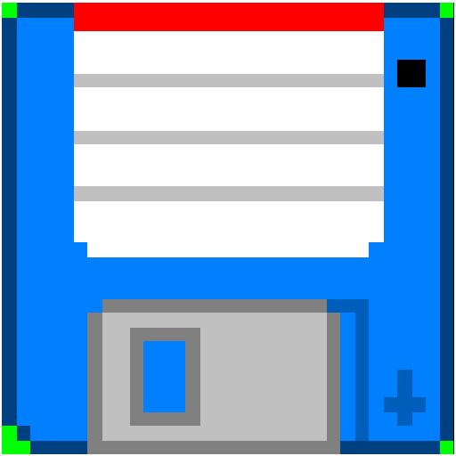

<p align="center">
  
</p>
<h1 align=center>
  <strong>vach</strong>
</h1>
<p align=center> A simple archiving format, designed for storing assets in compact secure containers </p>

<p align=center>
  <a href="https://crates.io/crates/vach"></a>
  <a href="https://docs.rs/vach"></a>
  <br/>
  <a href="https://github.com/zeskeertwee/vach/blob/main/LICENSE"></a>
  <a href="https://github.com/zeskeertwee/vach/actions/workflows/tests.yml"></a>
  <a href="https://github.com/zeskeertwee/vach/issues"></a>
</p>
<p align=center>
 <a href="https://docs.rs/vach">Docs</a> | <a href="https://github.com/zeskeertwee/vach">Repo</a>
</p>

`vach`, pronounced like "duck" but with a "v", is an archiving and resource transmission format. It was built to be secure, contained and protected. `vach` also has in-built support for multiple compression schemes (LZ4, Snappy and Brolti), [cryptographic hashing](https://github.com/dalek-cryptography/ed25519-dalek), custom [flags](https://docs.rs/vach/latest/vach/archive/struct.Flags.html) per entry and [encryption](https://docs.rs/aes-gcm/latest/aes_gcm/). Check out the `vach` spec at **[spec.txt](https://github.com/zeskeertwee/vach/blob/main/spec/main.txt)**. Any and *all* help will is much appreciated.

---

### 🤷 Who is what, when where?

- **vach:** An archiving format, like `tar`, `zip` and `rar`.  Also the base crate for handling `.vach` files in your application.
- **vach-cli:** <a href="https://crates.io/crates/vach-cli"></a> A CLI tool for dealing with `.vach` files.

---

### 👄 Terminologies

- **Archive Source:** Any source of data. That implements `io::Seek` and `io::Read`, for example a file (`fs::File`) or in memory buffer (`io::Cursor<Vec<u8>>`).
- **Leaf:** Any actual data endpoint within an archive, for example `footstep1.wav` in `sounds.vach`.
- **Entry:** Some data in the registry section of a `vach` source on an corresponding `leaf`. For example, `{ id: footstep.wav, location: 45, offset: 2345, flags: 0b0000_0000_0000_0000u16 }`.

---

### 🀄 Show me some code _dang it!_

```rust
let mut target = Cursor::new(vec![]);

// Data to be written
let data_1 = b"Around The World, Fatter better stronker" as &[u8];
let data_2 = b"Imagine if this made sense" as &[u8];
let data_3 = b"Fast-Acting Long-Lasting, *Bathroom Reader*" as &[u8];

// Builder definition
let config = BuilderConfig::default();

// Add data
let mut leaves = [
  Leaf::new(data_1, "d1").compress(CompressMode::Always),
  Leaf::new(data_2, "d2").compress(CompressMode::Never),
  Leaf::new(data_3, "d3").compress(CompressMode::Detect) // picks the smaller of the compressed and uncompressed
];

// write archive
dump(&mut target, &mut leaves, &config, None)?;

// Load data
let archive = Archive::new(target)?;

// Quick assertions
assert_eq!(archive.fetch("d1")?.data.as_slice(), data_1);
assert_eq!(archive.fetch("d2")?.data.as_slice(), data_2);
assert_eq!(archive.fetch("d3")?.data.as_slice(), data_3);
```

> For more information on how to use the library, read the documentation. [Always read the documentation!](https://youtu.be/TUE_HSgQiG0?t=91) or read the tests, they offer great insight into how the crate works.

---

### 🛠 Yet to be implemented

- [x] An official **CLI**, [check it out](https://crates.io/crates/vach-cli).
- [x] Data encryption.
- [x] Benchmarks.
- [x] Features to turn off (or to turn on) either the `builder` or the `loader` modules.
- [x] `Some(examples)` instead of `None`
- [ ] Skynet, (coming _very_ soon).
- [ ] Some proper benchmarking code. (Call for participation)

> If you appreciate the works of this repo, consider dropping a star. It will be much appreciated; 🌟
